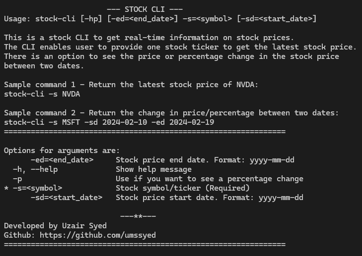

# Command Line Interface for Stock Price information
A Java CLI for getting stock information.
This is a Command Line Interface application which generates up-to-date stock information 
The application utilized eodhd.com finance API.


## Table of Contents
+ [About](#about)
+ [Usage](#usage)
    + [Example Usage in CMD](#example_usage)
+ [Getting Started](#getting_started)
    + [Prerequisites](#prerequisites)
    + [Finance API](#finance_api)
+ [Project Setup](#project_setup)
    + [Clone the repository](#clone_repo)
    + [Create the config files](#configs)
    + [Create the configuration file](#configs)
+ [Run Application](#run_app)
+ [License](#license)

## About <a name = "about"></a>
A command line interface for easily getting the latest stock price. This application also enables you to get the change in stock price and percentage between two dates.

### Usage: <a name = "usage"></a>
Usage: ```stockcli [-hp] [-ed=<end_date>] -s=<symbol> [-sd=<start_date>]```

Option arguments:
```java
-h, --help             Show help message
-s=<symbol>            Stock symbol/ticker (Required)
-sd=<start_date>       Stock price start date. Format: yyyy-mm-dd
-ed=<end_date>         Stock price end date. Format: yyyy-mm-dd
-p                     Use if you want to see a percentage change
```

#### Example Usage in CMD: <a name = "example_usage"></a>
##### 1. Sample Command 1 - Return the latest stock price of NVidia (NVDA):
```cmd
$ C\Users\stock-cli> stock-cli -s NVDA
```


##### 2. Sample Command 2 - Return the change in price between two dates:
```cmd
$ C\Users\stock-cli> stock-cli -s MSFT -sd 2024-02-10 -ed 2024-02-19
```


##### 3. Sample Command 3 - Display the change in percentage between the two dates also:
```cmd
$ C\Users\stock-cli> stock-cli -s MSFT -sd 2024-02-10 -ed 2024-02-19 -p
```


##### 4. Sample Command 4 - Display the change in price and percentage from a starting date to current date
```cmd
$ C\Users\stock-cli> stock-cli -s AAPL -sd 2024-02-10 -p
```


##### 5. Sample Command 5 - Show help
```cmd
$ C\Users\stock-cli> stock-cli -h
```

      
## Getting Started <a name = "getting_started"></a>
The following instructions will get you the copy of the project set up in your local machine to start running
the command line interface stock-cli and getting stock prices quickly!

### Prerequisites <a name = "prerequisites"></a>
You will need to have Java >= 11 installed in your local machine.

#### Finance API <a name = "finance_api"></a>
The stock-cli project requires you to have a Finance API from eodhd.com. Below are the steps to get a free API.
1. Navigate to https://eodhd.com/
2. On the top bar, go to Documentation > End of Day API
3. Click on Register and Get Data to sign up
4. You will receive a free API key. See below instructions on how to configure the API Key in the project file
5. The free API key has a limit of 20 API calls per day. Each call will consume 1 API limit. See your eodhd.com dashboard for more information.

## Project Setup <a name = "project_setup"></a>
This section goes through configuring your API key, and building the project.

### Clone the repository <a name = "clone_repo"></a>
Clone the repository from github to your local machine.

### Create the configuration file <a name = "configs"></a>
To successfully make the API call for the stock-cli application, we need to set up a configuration file that can use your free API key you received from eodhd.com.

Using the IDE of your choice, navigate to ```src/main/java/config``` folder. Create a new file ```config.properties``` (please make sure the file name is called exactly this).
Open the ```config.properties``` file and add an entry:
```java
API_KEY = <your_free_API_Key>
```
where your replace the ```<your_free_API_key>``` with the API key you received. Please make sure you do not add any qoutations around the API key.

Example:
```java
API_KEY = A123bCD45EF6
```

## Run Application <a name = "run_app"></a>
Now you are ready to run the application.

Go to your command prompt and run the following:
```cmd
$ C\Users> stock-cli -h
```
You should see the output:


## License <a name = "license"></a>
The project is licensed under the MIT license. View the [License File](LICENSE) for details.

